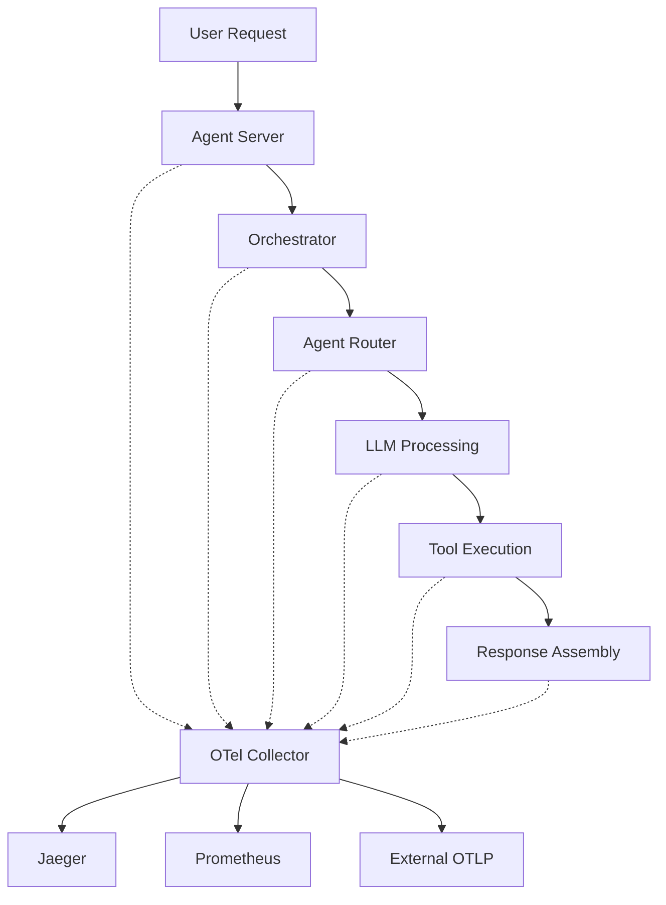

# Mantis Observability Architecture

This document describes the comprehensive observability stack implemented in Mantis for distributed agent coordination monitoring.

## Overview

Mantis uses a multi-layered observability approach combining:

- **Structured Logging**: JSON-formatted logs with trace correlation
- **Distributed Tracing**: OpenTelemetry-based request tracing across services
- **Metrics Collection**: Prometheus-compatible metrics via OpenTelemetry
- **Visualization**: Grafana dashboards with Jaeger trace integration

## Architecture Components

### 1. OpenTelemetry SDK Integration

**Location**: `src/mantis/observability/tracing.py`

Features:
- Service-specific tracer configuration
- Automatic HTTP instrumentation for agent-to-agent calls
- Custom span attributes for agent context
- Multiple exporter support (OTLP, Jaeger, Console)

```python
from mantis.observability.tracing import get_tracer

tracer = get_tracer("mantis.my-service")
with tracer.start_span("operation.name") as span:
    # Your code here
    span.set_attribute("custom.attribute", "value")
```

### 2. Distributed Tracing

**Trace Flow**:
```
User Request → Agent Server → Orchestrator → Agent Router → LLM → Tools → Agent Response
     ↓              ↓              ↓              ↓         ↓       ↓          ↓
 [trace-id]    [span: http]  [span: simulation] [span: route] [span: llm] [span: tool] [span: response]
```

**Key Spans**:
- `simulation.execute`: Complete simulation workflow
- `agent.process`: Individual agent processing
- `coordination.team`: Team coordination activities
- `tool.invoke`: Tool invocation operations

### 3. Structured Logging Enhancement

**Location**: `src/mantis/observability/logger.py`

Enhanced with OpenTelemetry correlation:
```json
{
  "timestamp": "2025-01-15T10:30:45.123Z",
  "level": "INFO",
  "message": "Agent processing request",
  "trace_id": "mantis-internal-123",
  "otel_trace_id": "4bf92f3577b34da6a3ce929d0e0e4736",
  "otel_span_id": "00f067aa0ba902b7",
  "structured_data": {
    "agent_name": "Chief of Staff",
    "context_id": "sim-456"
  }
}
```

### 4. OpenTelemetry Collector

**Location**: `deploy/otel-collector.yml`

**Pipeline Flow**:
```
Mantis Services → OTel Collector → [Jaeger, Prometheus, External OTLP]
                      ↓
              [Processing, Batching, Filtering]
```

**Key Processors**:
- **Batch**: Efficient export batching
- **Memory Limiter**: Prevents OOM
- **Resource**: Adds deployment context
- **Attributes**: Agent-specific enrichment

### 5. Service Configuration

Services are configured via environment variables:

```yaml
environment:
  # Service identification
  - OTEL_SERVICE_NAME=mantis-agent-server
  - OTEL_SERVICE_VERSION=1.0.0
  
  # Exporter configuration  
  - OTEL_EXPORTER_OTLP_ENDPOINT=http://otel-collector:4317
  - OTEL_EXPORTER_OTLP_INSECURE=true
  
  # Resource attributes
  - OTEL_RESOURCE_ATTRIBUTES=service.namespace=mantis.ai,deployment.environment=development
```

## Deployment

### Development Setup

Start with observability stack:
```bash
docker-compose -f docker-compose.yml -f docker-compose.observability.yml up -d
```

**Access Points**:
- Grafana: http://localhost:3000 (admin/admin)
- Jaeger UI: http://localhost:16686
- Prometheus: http://localhost:9090
- OTel Collector Health: http://localhost:13133/health

### Production Configuration

1. **Set External OTLP Endpoint**:
```bash
export OTEL_EXPORTER_OTLP_ENDPOINT=https://your-otlp-endpoint
export OTEL_EXPORTER_OTLP_TOKEN=your-auth-token
export MANTIS_ENV=production
```

2. **Scale Collector** (optional):
```yaml
otel-collector:
  deploy:
    replicas: 3
  environment:
    - OTEL_COLLECTOR_BALLAST_SIZE_MIB=512
```

3. **Configure Retention**:
```yaml
prometheus:
  command:
    - '--storage.tsdb.retention.time=30d'
```

## Usage Patterns

### 1. Tracing Agent Operations

```python
from mantis.observability.tracing import get_tracer

class MyAgent:
    def __init__(self):
        self.tracer = get_tracer("mantis.my-agent")
    
    @self.tracer.trace_agent_call("MyAgent", "process")
    async def process_request(self, request):
        # Automatically traced with agent context
        return await self._handle_request(request)
```

### 2. Adding Custom Metrics

```python
# In OpenTelemetry collector configuration
processors:
  transform:
    metric_statements:
      - context: metric
        statements:
          - set(name, "mantis_custom_metric") where name == "custom.counter"
```

### 3. Correlation Queries

**Find logs for a trace**:
```promql
{otel_trace_id="4bf92f3577b34da6a3ce929d0e0e4736"}
```

**Agent performance metrics**:
```promql
histogram_quantile(0.95, 
  rate(mantis_simulation_duration_bucket{agent_name="Chief of Staff"}[5m])
)
```

## Troubleshooting

### Common Issues

1. **Missing Traces**:
   - Check OTel collector health: `curl localhost:13133/health`
   - Verify OTLP endpoint connectivity
   - Check service environment variables

2. **High Memory Usage**:
   - Adjust collector memory limiter
   - Reduce batch sizes
   - Enable sampling for high-volume services

3. **Trace Gaps**:
   - Verify B3 propagation headers
   - Check network policies between services
   - Enable debug logging in collector

### Debug Commands

```bash
# Check collector metrics
curl localhost:8888/metrics | grep otelcol

# View service discovery
docker exec otel-collector cat /etc/otelcol-contrib/otel-collector.yaml

# Check Jaeger connectivity
curl localhost:16686/api/services

# Prometheus query API
curl "localhost:9090/api/v1/query?query=mantis_active_agents"
```

## Monitoring Dashboards

### Built-in Dashboards

1. **Mantis Overview** (`mantis-overview.json`):
   - Agent request rates
   - Response time percentiles  
   - Active agent instances
   - Error rates
   - Trace duration analysis

2. **Service Health**:
   - Container metrics via hostmetrics receiver
   - OpenTelemetry collector internal metrics
   - Service dependency mapping

### Custom Dashboard Creation

```json
{
  "dashboard": {
    "panels": [
      {
        "title": "Agent Coordination Success Rate",
        "targets": [{
          "expr": "rate(mantis_coordination_success_total[5m]) / rate(mantis_coordination_attempts_total[5m])"
        }]
      }
    ]
  }
}
```

## Best Practices

### 1. Naming Conventions

- **Services**: `mantis-{component}` (e.g., `mantis-agent-server`)
- **Spans**: `{component}.{operation}` (e.g., `agent.process`)
- **Attributes**: `{namespace}.{attribute}` (e.g., `mantis.context_id`)

### 2. Sampling Strategy

```yaml
# High-frequency operations
processors:
  probabilistic_sampler:
    sampling_percentage: 1.0  # Sample 1% of traces
    
# Critical paths  
processors:
  tail_sampling:
    policies:
      - name: errors
        type: status_code
        status_code: {status_codes: [ERROR]}
```

### 3. Resource Management

- Set appropriate memory limits on collector
- Use batch processing for efficiency
- Configure retention policies based on data volume
- Monitor collector resource usage

### 4. Security Considerations

- Use TLS for OTLP endpoints in production
- Rotate API tokens regularly
- Filter sensitive attributes before export
- Implement access controls on observability tools

## Integration Points

### Agent Coordination Workflow



This comprehensive observability stack enables deep visibility into the Mantis agent coordination system, supporting both development debugging and production monitoring needs.