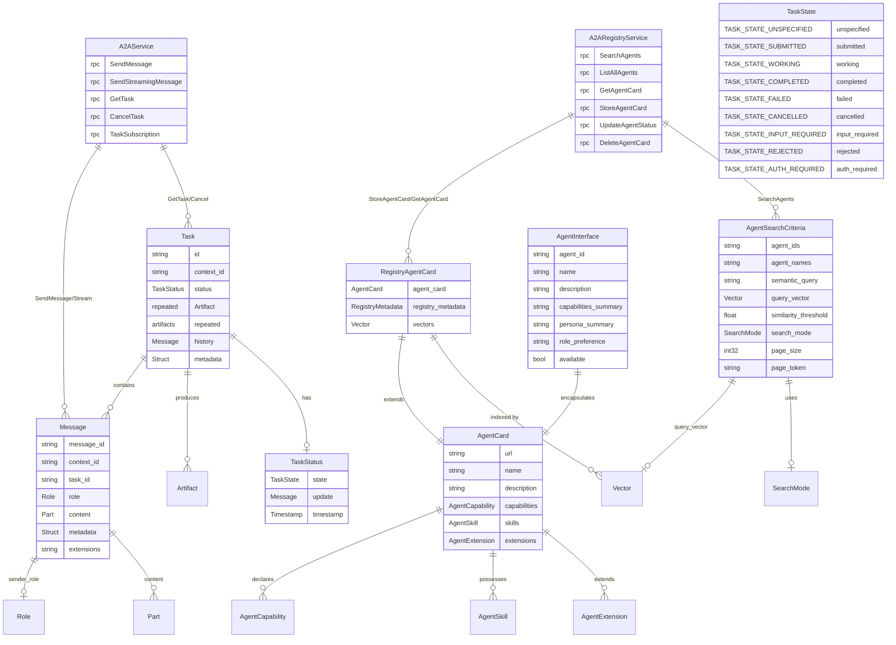

# Mantis System Entity Relationship Diagram (Simplified)

```mermaid
erDiagram
    %% Core Services
    MantisService {
        rpc ProcessSimulationInput
        rpc ProcessTeamExecutionRequest
        rpc ProcessNarratorRequest
    }
    
    A2AService {
        rpc SendMessage
        rpc SendStreamingMessage
        rpc GetTask
        rpc CancelTask
        rpc TaskSubscription
    }
    
    A2ARegistryService {
        rpc SearchAgents
        rpc ListAllAgents
        rpc GetAgentCard
        rpc StoreAgentCard
        rpc UpdateAgentStatus
        rpc DeleteAgentCard
    }

    %% Core Messages (7 Essential - Added ContextualPrompt)
    SimulationInput {
        string context_id
        string parent_context_id
        string query
        string context
        repeated Artifact input_artifacts
        ModelSpec model_spec
        int32 min_depth
        int32 max_depth
        AgentSpec agents
        ExecutionStrategy execution_strategy
    }
    
    SimulationOutput {
        string context_id
        string agent_url
        SimulationOutput results
        Message response_message
        repeated Artifact response_artifacts
        a2a_v1_Task simulation_task
        a2a_v1_TaskState final_state
        double total_time
        ExecutionStrategy execution_strategy
        int32 team_size
        int32 recursion_depth
    }
    
    %% Simplified Contextual Prompt Assembly (replaces complex composition)
    ContextualPrompt {
        string agent_name
        string prefix_context
        string postfix_context
        a2a_v1_Message message_template
    }
    
    TeamExecutionRequest {
        string base_query
        repeated ContextualPrompt member_prompts
        int32 team_size
        TeamFormationStrategy formation_strategy
        ExecutionStrategy preferred_execution_strategy
        Struct formation_config
    }
    
    TeamExecutionResult {
        string context_id
        a2a_v1_Task team_coordination_task
        repeated a2a_v1_Task member_tasks
        repeated Message member_messages
        repeated Artifact member_artifacts
        a2a_v1_TaskState team_final_state
        ExecutionStrategy execution_strategy
        double total_team_time
        repeated StreamResponse streaming_updates
    }
    
    AgentInterface {
        string agent_id
        string name
        string description
        string capabilities_summary
        string persona_summary
        string role_preference
        bool available
    }
    
    %% ContextualExecution replaces ExecutionContext with A2A context_id propagation
    ContextualExecution {
        string context_id
        string parent_context_id
        int32 current_depth
        int32 max_depth
        int32 team_size
        string assigned_role
        int32 agent_index
        string parent_task_id
        repeated string available_agent_ids
        double start_time
        ExecutionStrategy strategy
    }

    %% A2A Message/Part system replaces simple Message
    Message {
        string message_id
        string context_id
        string task_id
        Role role
        repeated Part content_parts
        Struct metadata
        repeated Extension extensions
    }
    
    Part {
        string part_type
        string content
        Struct metadata
        repeated Artifact artifacts
    }
    
    Artifact {
        string artifact_id
        string artifact_type
        string content
        Struct metadata
        string context_id
    }
    
    %% A2A Streaming capabilities
    StreamResponse {
        string context_id
        string task_id
        TaskStatusUpdateEvent status_update
        Message partial_message
        Artifact streaming_artifact
        Timestamp timestamp
    }
    
    TaskStatusUpdateEvent {
        string task_id
        TaskState previous_state
        TaskState current_state
        string update_message
        Timestamp timestamp
    }

    AgentSpec {
        int32 count
        ModelSpec model_spec
        int32 current_depth
    }
    
    ModelSpec {
        string model
        double temperature
    }

    %% A2A External Messages (Referenced)
    AgentCard {
        string url
        string name
        string description
        AgentCapability capabilities
        AgentSkill skills
        AgentExtension extensions
    }
    
    Message {
        string message_id
        string context_id
        string task_id
        Role role
        Part content
        Struct metadata
        string extensions
    }
    
    Task {
        string id
        string context_id
        TaskStatus status
        repeated Artifact artifacts
        repeated Message history
        Struct metadata
    }
    
    TaskStatus {
        TaskState state
        Message update
        Timestamp timestamp
    }
    
    TaskState {
        TASK_STATE_UNSPECIFIED unspecified
        TASK_STATE_SUBMITTED submitted
        TASK_STATE_WORKING working
        TASK_STATE_COMPLETED completed
        TASK_STATE_FAILED failed
        TASK_STATE_CANCELLED cancelled
        TASK_STATE_INPUT_REQUIRED input_required
        TASK_STATE_REJECTED rejected
        TASK_STATE_AUTH_REQUIRED auth_required
    }
    
    RegistryAgentCard {
        AgentCard agent_card
        RegistryMetadata registry_metadata
        Vector vectors
    }
    
    AgentSearchCriteria {
        string agent_ids
        string agent_names
        string semantic_query
        Vector query_vector
        float similarity_threshold
        SearchMode search_mode
        int32 page_size
        string page_token
    }


    %% Core Message Flow Relationships
    MantisService ||--o{ SimulationInput : "ProcessSimulationInput"
    MantisService ||--o{ TeamExecutionRequest : "ProcessTeamExecutionRequest"
    
    A2AService ||--o{ Message : "SendMessage/Stream"
    A2AService ||--o{ Task : "GetTask/Cancel"
    A2ARegistryService ||--o{ RegistryAgentCard : "StoreAgentCard/GetAgentCard"
    A2ARegistryService ||--o{ AgentSearchCriteria : "SearchAgents"

    %% Request/Response Relationships with A2A Context Propagation
    SimulationInput ||--o{ ModelSpec : "contains"
    SimulationInput ||--o{ AgentSpec : "contains multiple"
    SimulationInput ||--o{ Artifact : "input_artifacts"
    SimulationInput ||--o| ExecutionStrategy : "uses"
    
    TeamExecutionRequest ||--o{ ContextualPrompt : "contains member_prompts"
    TeamExecutionRequest ||--o| ExecutionStrategy : "uses"
    TeamExecutionRequest ||--o| TeamFormationStrategy : "uses"
    
    %% Simple Contextual Prompt Assembly Relationships
    ContextualPrompt ||--|| Message : "creates message_template"
    ContextualPrompt ||--o{ Artifact : "context variables stored as artifacts"

    %% Agent and Team Relationships
    AgentSpec ||--o{ ModelSpec : "contains"
    
    TeamExecutionResult ||--|| Task : "team_coordination_task"
    TeamExecutionResult ||--o{ Task : "member_tasks"
    TeamExecutionResult ||--o{ Message : "member_messages"
    TeamExecutionResult ||--o{ Artifact : "member_artifacts"
    TeamExecutionResult ||--o{ StreamResponse : "streaming_updates"
    TeamExecutionResult ||--|| TaskState : "team_final_state"
    TeamExecutionResult ||--o| ExecutionStrategy : "uses"

    %% Simulation and Output Relationships with Rich A2A Integration
    SimulationOutput ||--o{ SimulationOutput : "nested results"
    SimulationOutput ||--|| Message : "response_message"
    SimulationOutput ||--o{ Artifact : "response_artifacts"
    SimulationOutput ||--|| Task : "simulation_task"
    SimulationOutput ||--|| TaskState : "final_state"
    
    %% A2A Message/Part/Artifact Relationships
    Message ||--o{ Part : "content_parts"
    Message ||--o{ Extension : "extensions"
    Message ||--o| Role : "role"
    Part ||--o{ Artifact : "artifacts"
    Part ||--o| Struct : "metadata"
    Artifact ||--o| Struct : "metadata"
    
    %% A2A Streaming Relationships
    StreamResponse ||--o| TaskStatusUpdateEvent : "status_update"
    StreamResponse ||--o| Message : "partial_message"
    StreamResponse ||--o| Artifact : "streaming_artifact"
    TaskStatusUpdateEvent ||--o| TaskState : "previous_state"
    TaskStatusUpdateEvent ||--o| TaskState : "current_state"

    %% Context Propagation Relationships (A2A Integration)
    ContextualExecution ||--o{ string : "available_agent_ids"
    ContextualExecution ||--o| ExecutionStrategy : "uses"
    SimulationInput ||--o| ContextualExecution : "context_id"
    TeamExecutionResult ||--o| ContextualExecution : "context_id"
    SimulationOutput ||--o| ContextualExecution : "context_id"
    Message ||--o| ContextualExecution : "context_id"
    Artifact ||--o| ContextualExecution : "context_id"

    %% Agent Interface Relationships
    AgentInterface ||--|| AgentCard : "encapsulates"

    %% A2A Task Relationships
    Task ||--|| TaskStatus : "status"
    Task ||--o{ Artifact : "artifacts"
    Task ||--o{ Message : "history"
    
    TaskStatus ||--|| TaskState : "state"
    TaskStatus ||--|| Message : "update"
    TaskStatus ||--|| Timestamp : "timestamp"

    %% A2A Registry Relationships
    RegistryAgentCard ||--|| AgentCard : "extends"
    RegistryAgentCard ||--o{ Vector : "indexed by"
    AgentSearchCriteria ||--o| Vector : "query_vector"
    AgentSearchCriteria ||--o| SearchMode : "uses"
```

## System Architecture Overview (Deep A2A Integration)

This diagram shows the evolution from custom messages to deep A2A ecosystem integration, focusing on native A2A patterns while maintaining Mantis's unique team coordination value:

### **Core Services**
- **MantisService**: Main orchestration service for user requests and team coordination
- **A2AService**: Native A2A protocol service for rich message/artifact exchange
- **A2ARegistryService**: Full semantic agent discovery with vector search

### **Deep A2A Integration (Core Entities)**
1. **SimulationInput**: Context-threaded requests with A2A Artifact attachments
2. **SimulationOutput**: Rich A2A Messages with Parts and structured Artifacts
3. **TeamExecutionRequest**: Multi-agent coordination with simple ContextualPrompt assembly
4. **TeamExecutionResult**: Real-time streaming with Messages/Artifacts (not simple text)
5. **AgentInterface**: Encapsulated agent representation hiding complexity
6. **ContextualExecution**: A2A context_id threading for conversation continuity
7. **ContextualPrompt**: Simple contextual assembly replacing complex prompt composition

### **Native A2A Ecosystem Components**
- **Message/Part System**: Rich, structured communication replacing simple text
- **Artifact Management**: Structured data exchange through A2A entities
- **StreamResponse**: Real-time orchestration visibility
- **TaskStatusUpdateEvent**: Live task lifecycle updates

### **A2A TaskState Integration**
- **Task**: Full A2A task entity with ID, context, status, artifacts, and message history
- **TaskStatus**: Rich state tracking with TaskState enum, update message, and timestamp
- **TaskState**: Complete state enumeration (SUBMITTED, WORKING, COMPLETED, FAILED, etc.)
- **Hybrid Integration**: Team-level coordination tasks with individual member tasks

### **Updated ContextualPrompt and TeamExecutionRequest Structure**

```protobuf
message ContextualPrompt {
  // Agent identifier for targeting
  string agent_name = 1;
  
  // Context added before agent's base prompt
  string prefix_context = 2;        
  
  // Context added after agent's base prompt  
  string postfix_context = 3;       
  
  // Ready-to-use A2A Message template
  a2a.v1.Message message_template = 4; 
}

message TeamExecutionRequest {
  // Base query shared by all agents
  string base_query = 1;
  
  // Individual contextual prompts for each team member
  repeated ContextualPrompt member_prompts = 2;
  
  // Team size
  int32 team_size = 3;
  
  // Team formation strategy
  TeamFormationStrategy formation_strategy = 4;
  
  // Execution strategy preference
  ExecutionStrategy preferred_execution_strategy = 5;
  
  // Formation configuration
  google.protobuf.Struct formation_config = 6;
}
```

This simplified contextual prompt approach enables:
- **Simple Context Assembly**: prefix_context + base_query + postfix_context = contextualized prompt
- **Direct A2A Integration**: ContextualPrompt creates ready-to-use A2A Messages
- **Context Variable Storage**: Context variables stored as A2A Artifacts (not complex metadata)
- **Template-based Assembly**: Simple template substitution instead of complex composition strategies
- **Maximal A2A Leverage**: Uses A2A infrastructure instead of rebuilding complexity internally
- **Preserved Business Value**: Each agent gets contextualized prompts without architectural complexity

### **Simplified A2A Integration Flow Patterns**

1. **Context-Threaded Simulation Flow**:
   ```
   SimulationInput[context_id] → ContextualExecution → SimulationOutput[Message + Artifacts]
   ```

2. **Simple Contextual Team Flow**:
   ```
   base_query + ContextualPrompt[] → A2A Messages → TeamExecutionResult[streaming]
   ```

3. **Template Assembly Pattern**:
   ```
   prefix_context + agent_base_prompt + postfix_context = contextualized_a2a_message
   ```

4. **Direct A2A Message Creation**:
   ```
   ContextualPrompt → Message Template → Ready A2A Message → Agent Execution
   ```

5. **Context Propagation Pattern**:
   ```
   context_id → parent_context_id → task_hierarchy → conversation_continuity
   ```

### **Key Architectural Principles (Simplified A2A Integration)**

- **Context Threading**: A2A `context_id` propagation ensures conversation continuity across task hierarchies
- **Simple Template Assembly**: Context + Base Query = Contextualized A2A Message (no complex composition)
- **Direct A2A Message Creation**: ContextualPrompt directly generates ready-to-use A2A Messages
- **Artifact-Based Context Storage**: Context variables stored as A2A Artifacts (not complex metadata)
- **Maximal A2A Leverage**: Use A2A infrastructure instead of rebuilding complexity internally
- **Preserved Functional Essence**: Each agent gets contextualized prompts without architectural overhead
- **Real-time Streaming**: StreamResponse enables live orchestration and monitoring
- **Rich State Tracking**: A2A TaskState integration provides comprehensive execution lifecycle management
- **Native A2A Integration**: Full compatibility with A2A ecosystem (not just compatibility layer)

### **Deep A2A Integration Points**

The system now natively integrates the full A2A ecosystem:
- **Message/Part System**: Rich, structured communication replacing simple text responses
- **Artifact Management**: Structured data exchange through A2A Artifact entities
- **Context Threading**: Native A2A context_id propagation for conversation continuity
- **Streaming Orchestration**: Real-time coordination via StreamResponse and TaskStatusUpdateEvent
- **Agent Capabilities**: Through A2A `Extension` and `AgentSkill` references
- **Registry Integration**: Full vector search and semantic discovery capabilities
- **Task Lifecycle**: Complete A2A TaskState management throughout execution hierarchy

This deep A2A integration maintains Mantis's unique team coordination value while providing full ecosystem compatibility.

---

## Focused Entity Relationship Diagrams

The following sections break down the system into digestible, focused diagrams covering specific functional areas.

### 1. Core Orchestration Flow

This diagram shows the simplified primary services and message flow for basic simulation execution.

```mermaid
erDiagram
    %% Core Services
    MantisService {
        rpc ProcessSimulationInput
        rpc ProcessTeamExecutionRequest
    }

    %% Core Messages
    SimulationInput {
        string context_id
        string parent_context_id
        string query
        string context
        repeated Artifact input_artifacts
        ModelSpec model_spec
        int32 min_depth
        int32 max_depth
        AgentSpec agents
        ExecutionStrategy execution_strategy
    }
    
    SimulationOutput {
        string context_id
        string agent_url
        SimulationOutput results
        Message response_message
        repeated Artifact response_artifacts
        a2a_v1_Task simulation_task
        a2a_v1_TaskState final_state
        double total_time
        ExecutionStrategy execution_strategy
        int32 team_size
        int32 recursion_depth
    }
    
    Message {
        string text_response
        AgentExtension extensions
        string output_modes
        AgentSkill activated_skills
    }

    %% ContextualExecution replaces ExecutionContext with A2A context_id propagation
    ContextualExecution {
        string context_id
        string parent_context_id
        int32 current_depth
        int32 max_depth
        int32 team_size
        string assigned_role
        int32 agent_index
        string parent_task_id
        repeated string available_agent_ids
        double start_time
        ExecutionStrategy strategy
    }

    %% Supporting Messages
    ModelSpec {
        string model
        double temperature
    }
    
    AgentSpec {
        int32 count
        ModelSpec model_spec
        int32 current_depth
    }

    %% Core A2A-Integrated Relationships
    MantisService ||--o{ SimulationInput : "ProcessSimulationInput"
    SimulationInput ||--o{ ModelSpec : "contains"
    SimulationInput ||--o{ AgentSpec : "contains multiple"
    SimulationInput ||--o{ Artifact : "input_artifacts"
    SimulationInput ||--o| ExecutionStrategy : "uses"
    AgentSpec ||--o{ ModelSpec : "contains"
    
    SimulationOutput ||--o{ SimulationOutput : "nested results"
    SimulationOutput ||--|| Message : "response_message"
    SimulationOutput ||--o{ Artifact : "response_artifacts"
    
    ContextualExecution ||--o| ExecutionStrategy : "uses"
    ContextualExecution ||--o{ string : "available_agent_ids"
    
    %% A2A Message/Part/Artifact Relationships
    Message ||--o{ Part : "content_parts"
    Message ||--o{ Extension : "extensions"
    Part ||--o{ Artifact : "artifacts"
    Artifact ||--o| ContextualExecution : "context_id"
```

**Key Flow**: `SimulationInput[context_id + artifacts] → ContextualExecution → SimulationOutput[Message + Artifacts]`

This represents the deep A2A-integrated execution pattern where:
1. Client submits SimulationInput with context_id, query, and structured Artifacts
2. MantisService processes the request using ContextualExecution with A2A context threading
3. System returns SimulationOutput with rich Message (containing Parts) and structured Artifacts
4. Full A2A ecosystem integration enables conversation continuity and structured data exchange

### 2. Multi-Agent Team Coordination with Deep A2A Integration

This diagram focuses on team formation and execution with rich A2A Message/Part/Artifact exchange for coordinating multiple agents.

```mermaid
erDiagram
    %% Team Services (subset of MantisService)
    MantisService {
        rpc ProcessTeamExecutionRequest
    }

    %% Team Request Messages
    TeamExecutionRequest {
        string base_query
        repeated ContextualPrompt member_prompts
        int32 team_size
        TeamFormationStrategy formation_strategy
        ExecutionStrategy preferred_execution_strategy
        Struct formation_config
    }
    
    ContextualPrompt {
        string agent_name
        string prefix_context
        string postfix_context
        a2a_v1_Message message_template
    }
    
    TeamExecutionResult {
        string context_id
        a2a_v1_Task team_coordination_task
        repeated a2a_v1_Task member_tasks
        repeated Message member_messages
        repeated Artifact member_artifacts
        a2a_v1_TaskState team_final_state
        ExecutionStrategy execution_strategy
        double total_team_time
        repeated StreamResponse streaming_updates
    }
    
    AgentInterface {
        string agent_id
        string name
        string description
        string capabilities_summary
        string persona_summary
        string role_preference
        bool available
    }

    %% Supporting Messages
    SimulationInput {
        string query
        string context
        ExecutionStrategy execution_strategy
    }
    
    Message {
        string text_response
        AgentExtension extensions
        AgentSkill activated_skills
    }
    
    %% ContextualExecution replaces ExecutionContext with A2A context_id propagation
    ContextualExecution {
        string context_id
        string parent_context_id
        int32 current_depth
        int32 max_depth
        int32 team_size
        string assigned_role
        int32 agent_index
        string parent_task_id
        repeated string available_agent_ids
        double start_time
        ExecutionStrategy strategy
    }

    %% Team Flow Relationships
    MantisService ||--o{ TeamExecutionRequest : "ProcessTeamExecutionRequest"
    
    TeamExecutionRequest ||--o{ ContextualPrompt : "contains member_prompts"
    TeamExecutionRequest ||--o| ExecutionStrategy : "uses"
    TeamExecutionRequest ||--o| TeamFormationStrategy : "uses"
    
    ContextualPrompt ||--|| Message : "creates message_template"
    ContextualPrompt ||--o{ Artifact : "context variables as artifacts"
    
    TeamExecutionResult ||--|| Task : "team_coordination_task"
    TeamExecutionResult ||--o{ Task : "member_tasks"
    TeamExecutionResult ||--o{ Message : "member_messages"
    TeamExecutionResult ||--o{ Artifact : "member_artifacts"
    TeamExecutionResult ||--o{ StreamResponse : "streaming_updates"
    TeamExecutionResult ||--|| TaskState : "team_final_state"
    TeamExecutionResult ||--o| ExecutionStrategy : "uses"
    
    ContextualExecution ||--o| ExecutionStrategy : "uses"
    ContextualExecution ||--o{ string : "available_agents"
```

**Key Flow**: `base_query + ContextualPrompts[] → A2A Messages → TeamExecutionResult[streaming]`

This represents the simplified A2A-integrated multi-agent coordination pattern where:
1. Client submits TeamExecutionRequest with base_query and individual ContextualPrompts for each agent
2. Each ContextualPrompt creates a ready-to-use A2A Message through simple template assembly
3. Context variables are stored as A2A Artifacts instead of complex metadata tracking  
4. Simple template assembly: prefix_context + agent_base_prompt + postfix_context = contextualized message
5. Real-time StreamResponse updates provide live orchestration visibility
6. Maximum A2A leverage with preserved business value but minimal architectural complexity

### 3. Agent Interface & Context Propagation (A2A Integration)

This diagram shows the encapsulated agent representation and A2A context-threaded execution environment for conversation continuity.

```mermaid
erDiagram
    %% Core Agent Representation
    AgentInterface {
        string agent_id
        string name
        string description
        string capabilities_summary
        string persona_summary
        string role_preference
        bool available
    }
    
    %% Unified Execution Environment
    %% ContextualExecution replaces ExecutionContext with A2A context_id propagation
    ContextualExecution {
        string context_id
        string parent_context_id
        int32 current_depth
        int32 max_depth
        int32 team_size
        string assigned_role
        int32 agent_index
        string parent_task_id
        repeated string available_agent_ids
        double start_time
        ExecutionStrategy strategy
    }

    %% Supporting Core Messages
    SimulationInput {
        string context_id
        string parent_context_id
        string query
        string context
        repeated Artifact input_artifacts
        ModelSpec model_spec
        int32 min_depth
        int32 max_depth
        AgentSpec agents
        ExecutionStrategy execution_strategy
    }
    
    Message {
        string text_response
        AgentExtension extensions
        string output_modes
        AgentSkill activated_skills
    }
    
    %% Base A2A Integration
    AgentCard {
        string url
        string name
        string description
        AgentCapability capabilities
        AgentSkill skills
        AgentExtension extensions
    }
    
    ModelSpec {
        string model
        double temperature
    }

    %% Key Relationships
    AgentInterface ||--|| AgentCard : "encapsulates"
    ContextualExecution ||--o| ExecutionStrategy : "uses"
    ContextualExecution ||--o{ string : "available_agents"
    
    SimulationInput ||--o{ ModelSpec : "contains"
    SimulationInput ||--o| ExecutionStrategy : "uses"
    
    Message ||--o{ AgentExtension : "contains A2A extensions"
    Message ||--o{ AgentSkill : "references A2A skills"
    
    AgentCard ||--o{ AgentCapability : "declares"
    AgentCard ||--o{ AgentSkill : "possesses"
    AgentCard ||--o{ AgentExtension : "extends"
```

**Key Concept**: `AgentInterface` encapsulates complex persona data while `ContextualExecution` provides A2A context threading.

This represents the A2A-integrated encapsulation pattern where:
1. AgentInterface hides complex persona characteristics behind simple interface
2. ContextualExecution provides A2A context_id propagation for conversation continuity
3. Context threading replaces monolithic execution state with hierarchical context relationships
4. Base A2A AgentCard capabilities are accessible through encapsulation
5. System maintains clean separation while enabling rich A2A ecosystem integration

### 4. Essential Strategies & Coordination

This diagram shows the simplified strategy enums and coordination patterns that drive system behavior.

```mermaid
erDiagram
    %% Essential Strategy Enums
    ExecutionStrategy {
        DIRECT direct_execution
        A2A distributed_execution
    }
    
    TeamFormationStrategy {
        RANDOM random_selection
        HOMOGENOUS similar_agents
    }

    %% Core Coordination Messages
    SimulationInput {
        string context_id
        string parent_context_id
        string query
        string context
        repeated Artifact input_artifacts
        ModelSpec model_spec
        int32 min_depth
        int32 max_depth
        AgentSpec agents
        ExecutionStrategy execution_strategy
    }
    
    TeamExecutionRequest {
        SimulationInput simulation_input
        int32 team_size
        TeamFormationStrategy formation_strategy
        ExecutionStrategy preferred_execution_strategy
        Struct formation_config
    }
    
    %% ContextualExecution replaces ExecutionContext with A2A context_id propagation
    ContextualExecution {
        string context_id
        string parent_context_id
        int32 current_depth
        int32 max_depth
        int32 team_size
        string assigned_role
        int32 agent_index
        string parent_task_id
        repeated string available_agent_ids
        double start_time
        ExecutionStrategy strategy
    }
    
    AgentInterface {
        string agent_id
        string name
        string description
        string capabilities_summary
        string persona_summary
        string role_preference
        bool available
    }

    %% Strategy Relationships
    ExecutionStrategy ||--o{ SimulationInput : "drives"
    ExecutionStrategy ||--o{ TeamExecutionRequest : "configures"
    ExecutionStrategy ||--o{ ContextualExecution : "controls"
    
    TeamFormationStrategy ||--o{ TeamExecutionRequest : "determines selection"
    
    TeamExecutionRequest ||--|| SimulationInput : "contains"
    TeamExecutionRequest ||--o| ExecutionStrategy : "uses"
    TeamExecutionRequest ||--o| TeamFormationStrategy : "applies"
    
    ContextualExecution ||--o| ExecutionStrategy : "executes with"
    ContextualExecution ||--o{ string : "tracks agents"
```

**Key Concept**: Two essential strategies drive all system coordination - `ExecutionStrategy` and `TeamFormationStrategy`.

This represents the simplified coordination pattern where:
1. ExecutionStrategy (DIRECT/A2A) determines how agents are invoked
2. TeamFormationStrategy (RANDOM/HOMOGENOUS) controls agent selection for teams
3. All coordination messages reference these essential strategies
4. Complex decision trees are replaced with simple strategy enumeration
5. System behavior is predictable and easily configured

### 5. A2A Integration & Agent Discovery

This diagram shows simplified integration with the external A2A protocol services for agent communication and discovery.



**Key Flow**: `AgentSearchCriteria → RegistryAgentCard[] → AgentInterface → Message → Task`

This represents the simplified A2A integration pattern where:
1. System searches registry using AgentSearchCriteria with semantic/vector queries
2. A2ARegistryService returns matching RegistryAgentCard entries with vector metadata
3. AgentInterface encapsulates complex agent details for clean system integration
4. Selected agents receive Messages through A2AService for task execution
5. Tasks track execution lifecycle with simple status and artifact management

### 6. A2A TaskState Integration & Rich State Tracking

This diagram shows the A2A TaskState integration replacing boolean success flags with comprehensive state management.

```mermaid
erDiagram
    %% Unified Context
    %% ContextualExecution replaces ExecutionContext with A2A context_id propagation
    ContextualExecution {
        string context_id
        string parent_context_id
        int32 current_depth
        int32 max_depth
        int32 team_size
        string assigned_role
        int32 agent_index
        string parent_task_id
        repeated string available_agent_ids
        double start_time
        ExecutionStrategy strategy
    }

    %% Core Results with A2A TaskState Tracking
    SimulationOutput {
        string context_id
        string agent_url
        SimulationOutput results
        Message response_message
        repeated Artifact response_artifacts
        a2a_v1_Task simulation_task
        a2a_v1_TaskState final_state
        double total_time
        ExecutionStrategy execution_strategy
        int32 team_size
        int32 recursion_depth
    }
    
    TeamExecutionResult {
        string context_id
        a2a_v1_Task team_coordination_task
        repeated a2a_v1_Task member_tasks
        repeated Message member_messages
        repeated Artifact member_artifacts
        a2a_v1_TaskState team_final_state
        ExecutionStrategy execution_strategy
        double total_team_time
        repeated StreamResponse streaming_updates
    }

    %% A2A Task State Management
    Task {
        string id
        string context_id
        TaskStatus status
        repeated Artifact artifacts
        repeated Message history
        Struct metadata
    }
    
    TaskStatus {
        TaskState state
        Message update
        Timestamp timestamp
    }
    
    TaskState {
        TASK_STATE_UNSPECIFIED unspecified
        TASK_STATE_SUBMITTED submitted
        TASK_STATE_WORKING working
        TASK_STATE_COMPLETED completed
        TASK_STATE_FAILED failed
        TASK_STATE_CANCELLED cancelled
        TASK_STATE_INPUT_REQUIRED input_required
        TASK_STATE_REJECTED rejected
        TASK_STATE_AUTH_REQUIRED auth_required
    }

    %% Supporting Messages
    SimulationInput {
        string context_id
        string parent_context_id
        string query
        string context
        repeated Artifact input_artifacts
        ModelSpec model_spec
        int32 min_depth
        int32 max_depth
        AgentSpec agents
        ExecutionStrategy execution_strategy
    }
    
    Message {
        string text_response
        AgentExtension extensions
        string output_modes
        AgentSkill activated_skills
    }
    
    AgentInterface {
        string agent_id
        string name
        string description
        string capabilities_summary
        string persona_summary
        string role_preference
        bool available
    }

    %% A2A TaskState Relationships
    ContextualExecution ||--o{ string : "available_agents"
    ContextualExecution ||--o| ExecutionStrategy : "uses"
    
    SimulationOutput ||--o{ SimulationOutput : "nested results"
    SimulationOutput ||--|| Message : "contains"
    SimulationOutput ||--|| Task : "simulation_task"
    SimulationOutput ||--|| TaskState : "final_state"
    
    TeamExecutionResult ||--|| Task : "team_coordination_task"
    TeamExecutionResult ||--o{ Task : "member_tasks"
    TeamExecutionResult ||--o{ Message : "member_messages"
    TeamExecutionResult ||--o{ Artifact : "member_artifacts"
    TeamExecutionResult ||--o{ StreamResponse : "streaming_updates"
    TeamExecutionResult ||--|| TaskState : "team_final_state"
    TeamExecutionResult ||--o| ExecutionStrategy : "uses"
    
    Task ||--|| TaskStatus : "status"
    Task ||--o{ Artifact : "artifacts"
    Task ||--o{ Message : "history"
    
    TaskStatus ||--|| TaskState : "state"
    TaskStatus ||--|| Message : "update"
    TaskStatus ||--|| Timestamp : "timestamp"
    
    SimulationInput ||--o| ExecutionStrategy : "configures"
    
    Message ||--o{ AgentExtension : "contains A2A extensions"
    Message ||--o{ AgentSkill : "references A2A skills"
```

**Key Concept**: `ContextualExecution` provides unified execution state while A2A TaskState integration provides rich execution tracking.

This represents the A2A-integrated execution tracking pattern where:
1. ContextualExecution merges simulation and execution contexts into single unified state
2. A2A Task entities replace simple boolean flags with comprehensive state management
3. TaskState enum provides detailed execution states (SUBMITTED, WORKING, COMPLETED, FAILED, etc.)
4. Hybrid task management tracks both team coordination and individual member execution
5. Rich TaskStatus includes state, update message, and timestamp for complete visibility
6. System maintains essential coordination capabilities with enhanced A2A protocol integration

---

## Summary

These focused diagrams showcase the evolution from complex prompt composition to simplified contextual assembly with A2A integration:

1. **Core Orchestration Flow** - Context-threaded simulation with A2A Messages/Artifacts replacing text responses
2. **Multi-Agent Team Coordination** - Simplified ContextualPrompt assembly creating A2A Messages with template-based approach
3. **Agent Interface & Context Propagation** - A2A context threading for conversation continuity
4. **Essential Strategies & Coordination** - Two core strategies driving system behavior (removed complex prompt composition)
5. **A2A Integration & Agent Discovery** - Full ecosystem integration with native A2A patterns
6. **A2A TaskState Integration & Rich State Tracking** - Complete lifecycle management with streaming updates

## Simplified A2A Integration Evolution

**From Complex Composition to Simple Template Assembly:**

### Before (Complex Prompt Composition):
- `PromptCompositionService` with complex strategies
- `PromptCompositionStrategy` enum (LAYERED, BLENDED, CONDITIONAL)
- `PromptCompositionMetadata` with extensive tracking
- Multi-module composition engine with priority ordering
- Complex variable resolution and module selection

### After (Simple Contextual Assembly):
- `ContextualPrompt` with prefix_context, postfix_context, and message_template
- Direct A2A Message creation without complex composition strategies
- Context variables stored as A2A Artifacts (no complex metadata)
- Simple template assembly: prefix + base + postfix = contextualized message
- Maximum A2A infrastructure leverage instead of rebuilding complexity

## Key Architectural Improvements

The simplified contextual prompt approach achieves:

- **Functional Preservation**: Each agent still gets contextualized prompts for their specific role
- **Architectural Simplification**: Replace complex composition engine with simple template assembly
- **A2A Infrastructure Leverage**: Use A2A Artifacts for context storage instead of custom metadata
- **Direct Message Creation**: ContextualPrompt directly creates ready-to-use A2A Messages
- **Reduced Complexity**: Focus on business value (contextualization) while minimizing implementation overhead
- **Native A2A Integration**: Full ecosystem compatibility through simple, direct integration patterns

Each diagram demonstrates the evolution from complex prompt composition to simple contextual assembly while preserving the core business value and maintaining full A2A ecosystem integration.